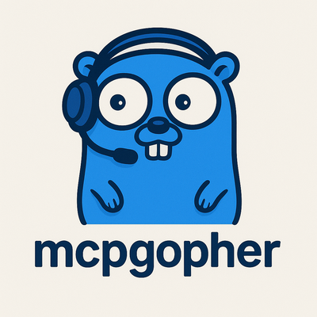

# mcpgopher

**mcpgopher** is a Go client implementation of the [Model Context Protocol (MCP)](http://spec.modelcontextprotocol.io/) based on the 2025-03-26 specification. This project is **client-only**—it does not provide any server-side components.

---

## About Model Context Protocol (MCP) — 2025 Spec

Model Context Protocol (MCP) is an open protocol that standardizes how applications and language models (LLMs) exchange contextual information, expose tools, and build composable AI workflows. The 2025-03-26 specification introduces robust security, consent, and capability negotiation features, making it suitable for integrating LLMs with external data sources and tools in a secure and user-controlled manner.

### Key Concepts

- **JSON-RPC 2.0**: MCP uses JSON-RPC messages for communication.
- **Stateful Connections**: Persistent sessions between hosts, clients, and servers.
- **Capability Negotiation**: Clients and servers negotiate supported features at connection time.

### Roles

- **Host**: The LLM application that initiates connections.
- **Client**: The connector (this project) that runs within the host application.
- **Server**: External service providing context, data, or tools.

### Features

- **Resources**: Share context and data with LLMs.
- **Prompts**: Templated messages and workflows.
- **Tools**: Functions that the AI model can execute.
- **Sampling**: (Client feature) Allows server-initiated agentic behaviors and recursive LLM interactions.

### Security & Trust

The 2025 spec emphasizes:
- **User Consent**: Users must explicitly approve all data access and tool usage.
- **Data Privacy**: No user data is shared without explicit consent.
- **Tool Safety**: Arbitrary code execution is strictly controlled and must be authorized by the user.
- **LLM Sampling Controls**: Users control when and how LLM sampling occurs.

### Utilities

- Configuration management
- Progress tracking
- Cancellation and error reporting
- Logging

---

## Project Scope

- **Client-Only**: This repository implements only the MCP client role. It does not include any server-side logic or hosting capabilities.
- **No Server**: If you need an MCP server, refer to other projects or the official MCP documentation.

---

## Getting Started

1. **Install**:  
   `go get github.com/contriboss/mcpgopher`

2. **Usage**:  
   Import and use the client in your Go application to connect to MCP servers and integrate LLM context, tools, and workflows.

3. **Documentation**:  
   Refer to the [official MCP specification](http://spec.modelcontextprotocol.io/) for protocol details and integration guidelines.

---

## License

MIT License © 2025 contriboss

---

## Resources

- [MCP Specification (2025-03-26)](http://spec.modelcontextprotocol.io/)
- [MCP GitHub](https://github.com/modelcontextprotocol)
- [Contributing](http://spec.modelcontextprotocol.io/#contributing)

---

**Note:** This project is under active development and tracks the latest MCP 2025 specification. Contributions and feedback are welcome!